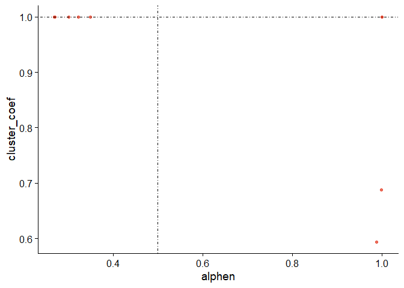
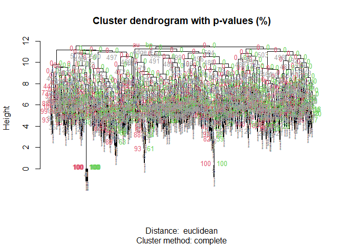
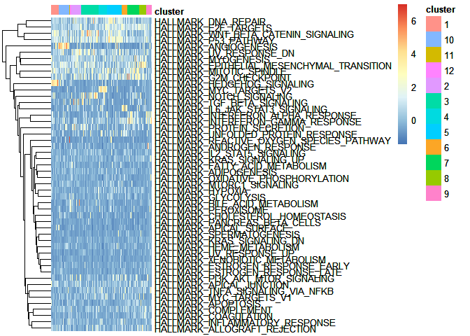
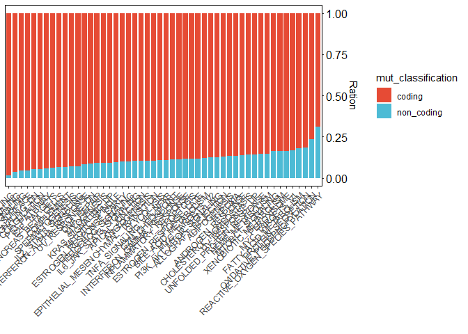
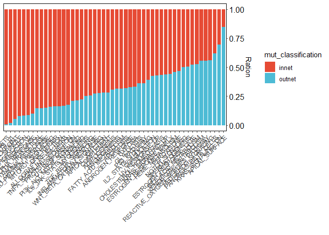
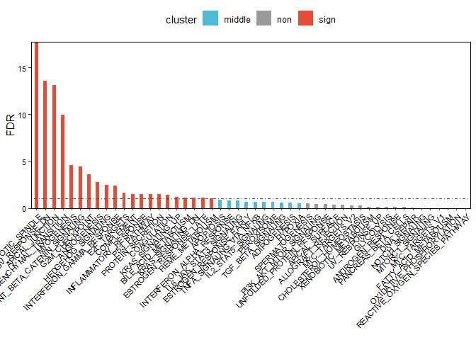
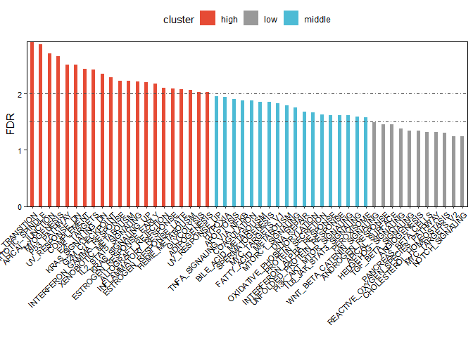

Weighted Hallmark Gene Set Mutation burden
================
YuHong Huang

<!-- README.md is generated from README.Rmd. Please edit that file -->

# Package name is IWHMB

The goal of IWHMB is to calculate Individual Weighted Hallmark Gene Set
Mutation burden,Details of algorithm principles will be further
published after the article is published. However, due to time
constraints, IWHMB currently refers to supporting Windows systems, and
this problem will be solved in later

## Installation

You can install the development version of IWHMB thrugh Through github
or source code

``` r
#devtools::install_github("YuHongHuang-lab/IWHMB") #download from github
```

## Example

### color table set

``` r
library(ggsci)
my_pal = c(pal_npg()(12), pal_aaas()(12), pal_futurama()(12))
my_pal = my_pal[!is.na(my_pal)]
my_pal = my_pal[!duplicated(my_pal)]
```

### Creat a PathObject

Please change the file path to your own

``` r
library(IWHMB)
TCGA_PathObj = CreatePathObject(gmt_path="E:/source_code/data/h.all.v7.4.symbols.gmt",
                                gene_exp_counts='E:/source_code/data/TCGA_HNSC_gene_exp_count.csv',
                                gene_map='E:/source_code/data/Homo_sapiens.GRCh38.99.chr.gtf',
                                gene_exp_TPM="E:/source_code/data/TCGA_HNSC_gene_exp_TPM_tumor.csv",
                                ppi_data_path="E:/source_code/data/ppi_dataset_all.txt",
                                cor_method=1,
                                mut_exp="E:/source_code/data/TCGA-HNSC_UCSC.varscan2_snv.tsv.gz",
                                count_log=FALSE,
                                TPM_log=FALSE,
                                GeneSetCollect=FALSE,
                                sep = "\t")
```

### Calculate the network Features of the Cancer Pathway Network or Hallmark Gene Set Network

### Plot Network Feature

``` r
plot_point_samllworld(TCGA_PathObj, my_pal=my_pal) # Small world
```



``` r
plot_point_fetsig(TCGA_PathObj, my_pal=my_pal) #Network Significance
```


### Calculation of IWHMB for every patient

### Tumor molecular subtype based on pathway mutation. two Cluster method: 1 Consensus clustering 2 hierarchical clustering

``` r
dir.create("test/ConsensusCluster")

# Consensus clustering 
TCGA_PathObj = ConsensusCluster(obj = TCGA_PathObj, 
                                maxK = 9, 
                                repcount = 50, 
                                pSample = 0.8, 
                                pRow = 1, 
                                distance = 'euclidean', 
                                clusterAlg = 'km',
                                seed = 123456,
                                out_dir = "test/ConsensusCluster")
#> end fraction
#> clustered
#> clustered
#> clustered
#> clustered
#> clustered
#> clustered
#> clustered
#> clustered

# Calculation of ICI(Consensus score)
TCGA_PathObj = calculate_ICI(TCGA_PathObj)
```

### hierarchical clustering Computing the uncertainty of clustering using pvcluster function

``` r
TCGA_PathObj = Hclust(TCGA_PathObj, nboot = 10)
#> Bootstrap (r = 0.5)... Done.
#> Bootstrap (r = 0.6)... Done.
#> Bootstrap (r = 0.7)... Done.
#> Bootstrap (r = 0.8)... Done.
#> Bootstrap (r = 0.9)... Done.
#> Bootstrap (r = 1.0)... Done.
#> Bootstrap (r = 1.1)... Done.
#> Bootstrap (r = 1.2)... Done.
#> Bootstrap (r = 1.3)... Done.
#> Bootstrap (r = 1.4)... Done.
```



### Select the number of clusters according to the clustering method, and draw the clustering heat map

``` r
TCGA_PathObj = SelectBestClusterNum(obj = TCGA_PathObj,
                                    method="hclust",
                                    k=12)
```



### The relationship between gene somatic cell mutation and Pathway Network or Hallmark Gene Set Network

#### Somatic mutation data processing

#### 

Distribution of coding and non coding mutations in networks

``` r
plot_mut_classification(obj = TCGA_PathObj, my_pal, mut_classifcation)
```



#### 

Relationship between somatic Mutation and Network

``` r
plot_mut_distribution(obj = TCGA_PathObj, my_pal, mut_classifcation)
```



#### Enrichment of mutation in the network

``` r
mut_enrich(obj = TCGA_PathObj, my_pal=my_pal, mut_classifcation=mut_classifcation,
           degree=2)
```



#### mean Pathway or Hallmark Gene Set mutation number per patient

``` r
#plot
plot_bar(df = outTab_df_mean_TCGA, my_pal = my_pal)
```


